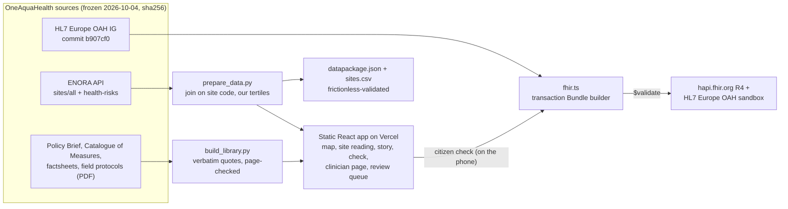

# StreamRecord

**What a stream's OneAquaHealth record means for the people, pets and wildlife living next to it, in their own language, and what the city can do about it.**

- Live: https://streamrecord.vercel.app
- Video: _added at submission_
- Built for the OneAquaHealth IEEE Global Hackathon 2026. Work on this repository started on 2026-10-04, within the submission window the organisers extended to 4 October (Devpost update "Deadline Extended to October 4"); the commit history is intact.

**Judges, 90 seconds:**
1. Open the [story](https://streamrecord.vercel.app/#/story): OneAquaHealth's findings, verbatim and page-cited, in six languages.
2. Open any [site reading](https://streamrecord.vercel.app/#/site/C5): the lab record, what it means for people, animals and the stream, and measures from the Catalogue of Measures.
3. Open [Review](https://streamrecord.vercel.app/#/review), add the sample check and confirm it.
4. Open [Sources and data](https://streamrecord.vercel.app/#/sources) for the FHIR validation table and the data package.

## Architecture



- **No server, no account, no cold start.** The app is static files on a CDN. Citizen checks are stored on the phone and turned into FHIR R4 in the browser.
- **Frozen, fingerprinted data.** Every snapshot is hashed, and the app makes no live calls. Swapping in the live ENORA API means changing two fetches in `scripts/`; the join and the bands are already code.
- **Scaling to more cities** needs only new ENORA sites and a translation file. The site pages, story, FHIR and data package are generated.

## 1. Track alignment

**Track 4 (Awareness & Storytelling) primary; Track 7 (Digital Health Standards) and Track 1 (Citizen Science UX) secondary.**

- **Track 4 ("educational modules, storytelling, and personalized insights").**
  - **Story:** [What 100 streams told OneAquaHealth](https://streamrecord.vercel.app/#/story) tells the project's findings in seven chapters. Every step is a verbatim Policy Brief finding with its page, linked by one short line of ours to real sites in the data, and it ends with a three-question quiz.
  - **Official translations:** in Portuguese, Italian, Dutch, Norwegian and French the quotes are OneAquaHealth's own translations from the multilingual edition (Zenodo 10.5281/zenodo.22025388). A script checked all 60 against their cited pages.
  - **Readings:** every reading is built on OneAquaHealth's own outputs: the lab health-risk scores from the ENORA API, the Policy Brief, the Catalogue of Measures and the indicator factsheets. Each finding is explained for people, for animals and for the stream itself, with a printable version for a GP or public-health officer.
- **Track 7.** Each citizen check becomes a FHIR R4 transaction Bundle. The OneAquaHealth IG is pinned to commit `b907cf0`, the Bundle is validated on two public servers with 0 errors, and every local code is listed with the reason it exists.
- **Track 1.** A 90-second field check with one question per screen and "Not sure" on every coded question. It works offline and needs no account.

## 2. Try it in 60 seconds

1. Open https://streamrecord.vercel.app on a phone.
2. Pick **Coimbra**, then any site in the list. You get the lab health-risk score, where it sits among the city's sites, and the date the scientists last sampled it.
3. Tap **Ler em português** to read the page in the city's language. The translations are marked as machine-assisted.
4. Tap **Do a 90-second check here** and answer the seven questions. Choose **Not sure** at least once.
5. After saving, tap **Show the FHIR record** to see the Bundle the check produced. The site page now shows what you saw, and what it can mean for people, animals and the stream.
6. Open **Clinician reading (printable)** and print it (A4 print layout).
7. Open **Review**, press **Add a sample check to try the review**, and confirm or reject it with a reason. The site page then shows the finding as confirmed, or stops counting it.
8. Open **Sources and data** for the validation table, licences and the machine-readable data package.

## 3. What is real and what is synthetic

| Item | Status | Note |
|---|---|---|
| 106 research sites (names, coordinates, cities) | Real | ENORA API snapshot, 2026-10-04 |
| Lab health-risk score and its three parts (96 sites) | Real | ENORA API snapshot; sampled 2023-05-05 to 2024-08-05 |
| Low / moderate / high bands | Ours | Tertiles of the 96 scores (cut points 0.2269 and 0.3491). **Not an official OneAquaHealth rating** |
| Citizen checks | Real when you make one | Stored only on your phone. No account, no server, and the app ships with no pre-filled checks |
| Catalogue of Measures and Policy Brief text | Real | Quoted with page numbers |
| People / animals / stream explanations | Ours | Drafted by a final-year medical student. Not clinical advice |
| Translations of our interface text (PT, IT, NL, NO, FR) | Machine-assisted | Not reviewed by native speakers; marked in the app |
| OneAquaHealth quotes in the story and home page, in PT, IT, NL, NO, FR | Official | OneAquaHealth's own translations (Zenodo multilingual edition), each with its page; 60 checked by script |
| Second-look rules and the review queue | Ours | Four rules we wrote (dead fish; scum in water below 10 °C; water above 30 °C; four or more "Not sure"). Not OneAquaHealth rules. The queue runs on this phone |
| Sample check in the review queue | Synthetic | Added only when you press the sample button; labelled "sample, synthetic" wherever it appears |
| Sending checks to the OneAquaHealth sandbox | Not integrated | Bundles are built and validated, but the app does not POST them |

## 4. Sources and licences

| Source | Retrieved | Licence |
|---|---|---|
| ENORA API `sites/all`, https://api.enora-oah.eu/api/sites/all (sha256 `c0272962…f0c632`) | 2026-10-04 12:41Z | No licence stated; used for hackathon demonstration with attribution |
| ENORA API `resilience-map/health-risks`, https://api.enora-oah.eu/api/resilience-map/health-risks (sha256 `3aee0027…bf5aa8`) | 2026-10-04 12:42Z | As above |
| OneAquaHealth Policy Brief (May 2026), https://www.oneaquahealth.eu/app/uploads/2026/05/OneAquaHealth-Policy-Brief.pdf | 2026-10-04 | None stated on this copy; Zenodo edition [10.5281/zenodo.22025388](https://doi.org/10.5281/zenodo.22025388) is CC-BY-4.0 |
| OneAquaHealth Catalogue of Measures (D2.4), [10.5281/zenodo.20040211](https://doi.org/10.5281/zenodo.20040211) | 2026-10-04 | CC-BY-4.0 |
| OneAquaHealth Key Indicators Factsheets, [10.5281/zenodo.20345207](https://doi.org/10.5281/zenodo.20345207) | 2026-10-04 | CC-BY-4.0 |
| OneAquaHealth Field Sampling Protocols, [10.5281/zenodo.20344421](https://doi.org/10.5281/zenodo.20344421) | 2026-10-04 | CC-BY-4.0 |
| HL7 Europe OneAquaHealth FHIR IG, https://github.com/hl7-eu/oah at `b907cf0` | 2026-10-04 | Not set in the repository |
| Basemap: Esri World Light Gray Base | live tiles | Esri terms of use; OpenStreetMap data ODbL |

Every quote was checked by script against the single PDF page it cites; see [`content/SOURCES.md`](content/SOURCES.md). Foam, smell and dead fish appear in none of these documents, so the app quotes nothing for them. The data is frozen in `data/snapshots/`. The join method, the field shapes and the known quirks are documented in [`data/snapshots/SOURCE.md`](data/snapshots/SOURCE.md). One quirk worth knowing: the API's city id `BE` means Benevento, not Belgium. The app makes no live calls to the API.

## 5. FHIR

- **IG:** `hl7.eu.fhir.oah#0.1.0-ci-build`, pinned to commit [`b907cf0`](https://github.com/hl7-eu/oah/tree/b907cf0869b59d82d9138b3d147fca66f333d911). See [`fhir/ig.lock`](fhir/ig.lock).
- **Bundle:** a `transaction` containing:
  - `Location`, conditional create on the OneAquaHealth site code
  - `QuestionnaireResponse`
  - one `Observation` per answer
  - `Device` (the app)
  - `Provenance`
- **Profiles used:** `location-oah`. We confirmed it exists at the pinned commit and test its rules (identifier, name, `mode = instance`, position) in [`src/fhir.test.ts`](src/fhir.test.ts).
- **`observation-indicators-oah`, claimed only once confirmed.** The profile fixes `status = final`. An untrained citizen's report stays `preliminary` and does not claim it. Once a reviewer confirms the check, its Observations become `final` and claim the profile, so confirmed citizen data meets the same OAH Observation profile as lab indicators. Every rule of the profile is unit-tested.
- **OAH codes used** (all 12 confirmed in `temporarySystem-oah-eu` at `b907cf0`):
  - `foam`, `riparianVegetation`, `macrophytes`, `invasiveOrganisms`, `waterTemperature`
  - `present`, `absent`
  - `0-20-percent` … `81-100-percent`
- **"Not sure"** becomes `dataAbsentReason = asked-unknown` (FHIR core) with no value.
- **Review:** a check is `preliminary` until a reviewer decides.
  - Confirming sets every Observation to `final`.
  - Rejecting sets them to `entered-in-error`, sets the QuestionnaireResponse to `entered-in-error`, and stops the check counting in the reading.
  - Either decision adds a second `Provenance` with:
    - agent type `verifier`;
    - activity `UPDATE`;
    - `reason` coded `v3-ActReason#HQUALIMP` (health quality improvement, confirmed in `v3-PurposeOfUse` on tx.fhir.org), with the reviewer's own words as text.
- **Units:** temperature uses UCUM `Cel`.
- **Local codes, and why** (published as a real CodeSystem at https://streamrecord.vercel.app/fhir/CodeSystem/streamrecord-local):
  - `citizen-science`: we found no standard Observation category for citizen data.
  - `colourSmell`: OAH `foam` means "Foam/colour/smell" as one concept. We ask about colour and smell separately.
  - `scum`, `deadFish`, `standingWater`, `none`: these are not in the OAH CodeSystem at this commit.
- **Questionnaire:** the IG has none, so ours is published at https://streamrecord.vercel.app/fhir/Questionnaire/streamrecord-check.

## 6. Evidence

**`$validate`.** Run by [`scripts/validate.ts`](scripts/validate.ts) on a real bundle for site C1 (Coimbra), with synthetic answers chosen to exercise every value type. Whole bundles are validated in three states: as recorded, confirmed by a reviewer and rejected by a reviewer ([`evidence/sample-bundle-reviewed.json`](evidence/sample-bundle-reviewed.json)). The bundle is in [`evidence/sample-bundle.json`](evidence/sample-bundle.json) and the raw results are in [`evidence/validate.json`](evidence/validate.json).

| Resource | Server | Checked against | Errors | Warnings | Checked (UTC) |
|---|---|---|---|---|---|
| Location | `hapi.fhir.org/baseR4` | base R4; location-oah rules checked by unit test (IG not on server) | 0 | 0 | 2026-10-04 18:14 |
| QuestionnaireResponse | `hapi.fhir.org/baseR4` | base R4 | 0 | 1 | 2026-10-04 18:14 |
| Observation:foam | `hapi.fhir.org/baseR4` | base R4 | 0 | 3 | 2026-10-04 18:14 |
| Observation:colourSmell | `hapi.fhir.org/baseR4` | base R4 | 0 | 2 | 2026-10-04 18:14 |
| Observation:riparianVegetation | `hapi.fhir.org/baseR4` | base R4 | 0 | 3 | 2026-10-04 18:14 |
| Observation:macrophytes | `hapi.fhir.org/baseR4` | base R4 | 0 | 3 | 2026-10-04 18:14 |
| Observation:invasiveOrganisms | `hapi.fhir.org/baseR4` | base R4 | 0 | 3 | 2026-10-04 18:14 |
| Observation:otherSigns | `hapi.fhir.org/baseR4` | base R4 | 0 | 3 | 2026-10-04 18:14 |
| Observation:waterTemperature | `hapi.fhir.org/baseR4` | base R4 | 0 | 2 | 2026-10-04 18:14 |
| Device | `hapi.fhir.org/baseR4` | base R4 | 0 | 0 | 2026-10-04 18:14 |
| Provenance | `hapi.fhir.org/baseR4` | base R4 | 0 | 0 | 2026-10-04 18:14 |
| Location | `sandbox.hl7europe.eu/oneaquahealth/fhir` | base R4; location-oah rules checked by unit test (IG not on server) | 0 | 0 | 2026-10-04 18:14 |
| QuestionnaireResponse | `sandbox.hl7europe.eu/oneaquahealth/fhir` | base R4 | 0 | 1 | 2026-10-04 18:14 |
| Observation:foam | `sandbox.hl7europe.eu/oneaquahealth/fhir` | base R4 | 0 | 0 | 2026-10-04 18:14 |
| Observation:colourSmell | `sandbox.hl7europe.eu/oneaquahealth/fhir` | base R4 | 0 | 0 | 2026-10-04 18:14 |
| Observation:riparianVegetation | `sandbox.hl7europe.eu/oneaquahealth/fhir` | base R4 | 0 | 0 | 2026-10-04 18:14 |
| Observation:macrophytes | `sandbox.hl7europe.eu/oneaquahealth/fhir` | base R4 | 0 | 0 | 2026-10-04 18:14 |
| Observation:invasiveOrganisms | `sandbox.hl7europe.eu/oneaquahealth/fhir` | base R4 | 0 | 0 | 2026-10-04 18:14 |
| Observation:otherSigns | `sandbox.hl7europe.eu/oneaquahealth/fhir` | base R4 | 0 | 0 | 2026-10-04 18:14 |
| Observation:waterTemperature | `sandbox.hl7europe.eu/oneaquahealth/fhir` | base R4 | 0 | 0 | 2026-10-04 18:14 |
| Device | `sandbox.hl7europe.eu/oneaquahealth/fhir` | base R4 | 0 | 0 | 2026-10-04 18:14 |
| Provenance | `sandbox.hl7europe.eu/oneaquahealth/fhir` | base R4 | 0 | 0 | 2026-10-04 18:14 |
| Bundle (check as recorded, preliminary) | `hapi.fhir.org/baseR4` | base R4 | 0 | 20 | 2026-10-04 18:14 |
| Bundle (confirmed by a reviewer, final) | `hapi.fhir.org/baseR4` | base R4 | 0 | 20 | 2026-10-04 18:14 |
| Bundle (rejected by a reviewer, entered-in-error) | `hapi.fhir.org/baseR4` | base R4 | 0 | 20 | 2026-10-04 18:14 |
| Bundle (check as recorded, preliminary) | `sandbox.hl7europe.eu/oneaquahealth/fhir` | base R4 | 0 | 2 | 2026-10-04 18:14 |
| Bundle (confirmed by a reviewer, final) | `sandbox.hl7europe.eu/oneaquahealth/fhir` | base R4 | 0 | 2 | 2026-10-04 18:14 |
| Bundle (rejected by a reviewer, entered-in-error) | `sandbox.hl7europe.eu/oneaquahealth/fhir` | base R4 | 0 | 2 | 2026-10-04 18:14 |
| Questionnaire (ours) | `hapi.fhir.org/baseR4` | base R4 | 0 | 0 | 2026-10-04 |
| CodeSystem streamrecord-local | `hapi.fhir.org/baseR4` | base R4 | 0 | 0 | 2026-10-04 |

Neither public server holds the OneAquaHealth IG. To make the base-R4 check possible, `meta.profile` is removed before the resource is sent, and the `location-oah` rules are checked by unit tests instead. All remaining warnings are "CodeSystem is unknown" or "questionnaire could not be resolved": the servers don't have that terminology loaded. Our Questionnaire and local CodeSystem each validate on HAPI with 0 errors and 0 warnings.

**Other measurements**

| Measure | Result |
|---|---|
| Unit tests | 18 passing (vitest): bundle structure, narratives, reference resolution, Not sure → dataAbsentReason, OAH codes, UCUM, status, conditional create, determinism, finding rules, location-oah rules, second-look rules, review statuses and verifier Provenance, unnamed sites |
| Lighthouse, Site Reading (mobile, production) | Performance 94, Accessibility 100, Best practices 100; LCP 1.6 s, CLS 0 |
| Lighthouse, Field check | Performance 99, Accessibility 100, Best practices 100; LCP 1.6 s |
| Lighthouse, Map | Performance 76 (median of three runs, range 64–89: LCP is a third-party basemap tile), Accessibility 97, Best practices 96 |
| JavaScript for the first view | 64 KB gzipped JavaScript for the first view (197 KB raw); the map library (44 KB gzipped) and each translation (~6 KB) load separately |
| Time to the first Site Reading | 1.6 s largest contentful paint for a Site Reading (Lighthouse simulated slow 4G) |

The map loses accessibility points for one reason: markers for neighbouring sites overlap, so they fail Lighthouse's target-spacing check. Every site is also a 48 px row in the list beside the map, which is the "equivalent control" exception in WCAG 2.2 SC 2.5.8. Lighthouse cannot detect that. Raw reports: [`evidence/summary.json`](evidence/summary.json).

**Machine-readable data.**
- [`public/data/datapackage.json`](public/data/datapackage.json) is a [Frictionless Data Package](https://specs.frictionlessdata.io/data-package/). It describes all 9 data files the app serves, each with its sha256, byte size, licence, upstream source and retrieval date.
- [`public/data/sites.csv`](public/data/sites.csv) holds all 106 sites in one typed table: full-precision scores from the raw ENORA snapshot, a primary key, and value constraints.
- `frictionless validate` (v5.19.1) reports every resource valid, including the hashes.
- On its first run the validator found that ENORA publishes sites **T21** and **T24** with an empty name. The app had been showing a blank heading for them. It now shows them as "Site T21" / "Site T24", says why, and gives their FHIR Location a name, since `location-oah` requires one.
- `npm run data` rebuilds the library, FHIR definitions, validation evidence, data package and evidence page, in that order.

## 7. Accessibility statement

The app targets WCAG 2.2 AA.
- **Status cues:** status is never shown by colour alone. Every status has a shape (circle, triangle, square, dashed circle) and a word, and the map colours come from the Okabe-Ito colour-blind-safe palette.
- **Field check:** one question per screen, following the GOV.UK pattern. Error summaries move focus to the problem and link to it.
- **Touch and type:** buttons, answer choices and list rows are 44–56 px tall; the small header links meet the WCAG 2.2 minimum of 24 px. Body text is set in Atkinson Hyperlegible Next, a typeface the Braille Institute designed for low-vision readers.
- **Map:** every site on the map is also in a plain list next to it, so the map is never the only way in.
- **Navigation and motion:** there is a skip link, a visible focus ring and support for reduced motion.
- **Language:** `lang` is set on the page for each language.

Known gaps: the map markers can be reached with a keyboard but have only their site name as a label, and nobody using a screen reader has tested the app yet.

## 8. Limitations and what it is not

- **It is not a water-safety verdict.** The lab score covers samples taken in 2023–2024. The app shows how long ago the scientists sampled each stream, and never says the water is safe or unsafe today.
- **The low/moderate/high bands are ours.** They are statistical thirds of the 96 scores, not thresholds set by OneAquaHealth.
- **Citizen checks are unverified.** They stay `preliminary`. A finding says "someone should look"; it never says the water is unsafe.
- **The health text is not clinical advice.** It was written by a medical student and has not been reviewed by a clinician or veterinarian.
- **No upload yet.** Checks stay on the phone and are not sent to the OneAquaHealth sandbox. That step is proposed, not integrated.
- **The review queue is on the same phone.** It demonstrates the workflow and the FHIR it produces. In a real deployment, the reviewer would be at the municipality or the OneAquaHealth team, with sign-in.
- **10 of the 106 sites have no health-risk value** (C17, C18, G1, G17–G20, T15, T21, T24). For these the app says so instead of guessing.

## 9. AI-assistance disclosure

StreamRecord was built with Claude Code (Anthropic). Claude Code was used for:
- fetching and joining the data;
- checking the IG at the pinned commit;
- writing the app and the tests;
- the first drafts of the translations and health text.

The concept, the review of the clinical framing and the final decisions are the author's. Every quote is copied verbatim from the cited page, and every code was checked against the IG source.

## 10. Run it locally

```
npm install
npm run dev        # http://localhost:5173
npm test           # unit tests
npx vite-node scripts/validate.ts   # re-run $validate (needs network)
```

## 11. Licence

Code is released under the MIT licence; see [LICENSE](LICENSE). Data and documents stay under their sources' terms.

**StreamRecord is not affiliated with, or endorsed by, OneAquaHealth, ENORA or HL7 Europe.**
